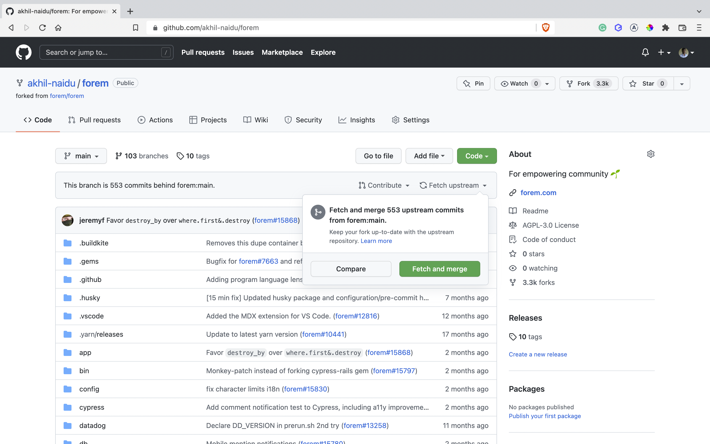
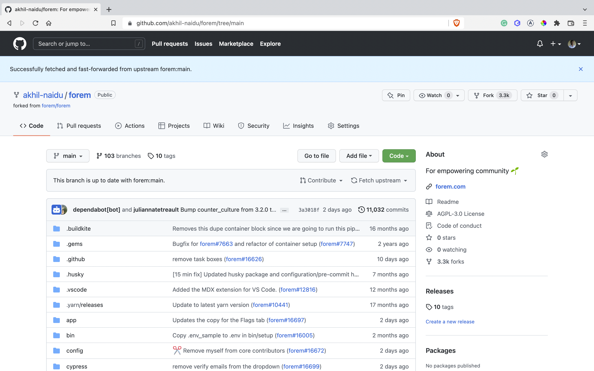

# Turn on the development server
## Requirements
> For development purpose this repository uses dirtyDB
Before starting the installation or server copy the content with in the `settings.json.template` to a new json file (`settings.json`)
```
cp settings.json.template settings.json
```
## Linux and Mac
> In Linux and Mac both the settings.json and syslinks are auto generated
1. Run the command `src/bin/run.sh` => Will install dependencies and run the server
2. To start the server when dependencies are already installed => `node src/node/server.js`

## Windows Operating System
> In Windows operating system, the syslinks are to be generated manually. An automated script is on its way, but for now you can use the `mklink` command to generate a new syslink
```
cd node_modules
mklink /D ep_Plugin_name ..\src\plugins\md_plugin_name
```
quick reference 


1. Open CMD as Administrator and navigate to the `node_modules` folder in the root directory and clear the folder. 
2. After clearing the `node_modules` create syslinks as shown in the reference image.(mandotory)
3. After creating syslinks for all or the required plugins, Navigate to the `src` folder in the root directory to install dependencies
4. Run the command `npm ci` to install all the dependencies.
5. Within the `src` folder, run the command `node bin\server.js` to start the server

# How to upgrade custom Signdesk repository to the latest version
### Step One
> It is mandatory to have a fork from the master/develop branch of the etherpad-lite.

Once we have the fork of the repo, it will provide us a lot of flexibility in maintaining the repository and also to keep it in sync with the latest updates and security patches.

### Step Two
> This step is what makes signdesk independent from etherpad-lite

MuDoc provides you with two extra folders compared to that of the existing master/develop branch of the etherpad-lite, they potentially consists of the theming and features.

In the `src` folder of the root directory, we can find a new folder under the name `plugins` which consists of all the plugins that we provide. This folder can also be used to extend the functionality by creating your own plugins without the need to create a npm package.

Similarly, you will also find customized folder at `src/static/skins/colibris`. This folder is used to customize the look and feel of the Signdesk. It was already customized and can also be extended by adding custom styles without worrying about modifying the core structure/styles.

### Final Step in updating/upgrading
> The above two steps form the building blocks for upgrading the customized etherpad, Signdesk.

In step one we took a fork from the develop or master branch, this allows us to capitalize the `Fetch Upstream` functionality. For more info on fetch upstream, [click here](https://docs.github.com/en/pull-requests/collaborating-with-pull-requests/working-with-forks/syncing-a-fork).

### A quick reference on how this fetch upstream functionality.

> This reference screenshot is an example of how fetch upstream would work.

In the following Screenshot, which is before fetching the upstream, it is evident that the main repository was behind `553 commits`. Now upon clicking `fetch and merge` we can update the current fork


Upon click on the `fetch and merge` button, this fork and the corresponding `custom: main brach` is up to date with the `core: main branch`


---

### How to utilise this fetch and merge functionality.

As demonstrated in step two, all the plugins are available in a separate directory which is in `src/plugins` folder and the theme is available in `src/static/skins/colibris`

Both these folders which are unique to signdesk are to be placed in their corresponding directories, it is up to the Signdesk developer team whether to make them available to public or to store them in private.
