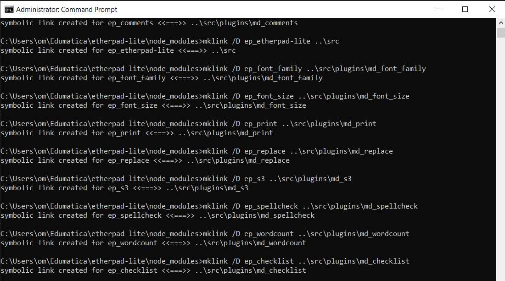

## Requirements
> For development purpose this repository uses dirtyDB
Before starting the installation or server copy the content with in the `settings.json.template` to a new json file (`settings.json`)
```
cp settings.json.template settings.json
```
## Linux and Mac
> In Linux and Mac both the settings.json and syslinks are auto generated
1. Run the command `src/bin/run.sh` => Will install dependencies and run the server
2. To start the server when dependencies are already installed => `node src/node/server.js`

## Windows Operating System
> In Windows opertaing system, the syslinks are to be generated manually. An automated script is on its way, but for now you can use the `mklink` command to generate a new syslink
```
cd node_modules
mklink /D ep_Plugin_name ..\src\plugins\md_plugin_name
```
quick reference 


1. Open CMD as Administrator and navigate to the `node_modules` folder in the root directory and clear the folder. 
2. After clearing the `node_modules` create syslinks as shown in the reference image.(mandotory)
3. After creating syslinks for all or the required plugins, Navigate to the `src` folder in the root directory to install dependencies
4. Run the command `npm ci` to install all the dependencies.
5. Within the `src` folder, run the command `node bin\server.js` to start the server
